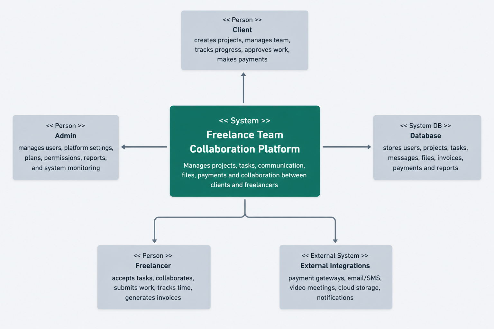

# Software Requirements Specification (SRS)

# Freelance Team Collaboration Platform

----------

# Preface

This document provides the Software Requirements Specification (SRS) for the Freelance Team Collaboration Platform. It defines the functional requirements, non-functional requirements, security standards, and system architecture necessary for development and deployment.

----------

# Version History

-   **Version 1.0** – Initial Draft
    

----------

# 1. Introduction

## Purpose

The Freelance Team Collaboration Platform is a web-based system designed to help freelancers, agencies, and clients efficiently manage projects, tasks, communication, file sharing, and payments within a unified environment. The system improves productivity, workflow transparency, and remote team coordination.

----------

## Document Conventions

This document follows IEEE SRS standards using:

-   **Must** – Mandatory requirements
    
-   **Should** – Recommended features
    
-   **May** – Optional enhancements
    

----------

## Intended Audience and Reading Suggestions

-   **Developers & Software Engineers** – System implementation guidance
    
-   **Project Managers** – Workflow understanding
    
-   **Clients & Stakeholders** – System capability overview
    
-   **Testers & QA Teams** – Requirement validation
    

----------

## Scope

The platform provides:

-   Freelancer and client management
    
-   Project and milestone tracking
    
-   Team collaboration and messaging
    
-   File sharing and document management
    
-   Invoice and payment tracking
    
-   Analytics and reporting dashboard
    
-   Notification and activity monitoring
    

----------

## References

-   IEEE Standard 830-1998
    
-   Agile Project Management Documentation
    
-   Software Architecture Design References
    

----------

# 2. Overall Description

## Product Perspective

The Freelance Team Collaboration Platform is a standalone cloud-based web application that may integrate with third-party services such as:

-   Slack
    
-   Zoom
    
-   PayPal
    
-   Stripe
    

----------

## Product Functions

-   **User Management:** Register and manage freelancer, client, and admin accounts.
    
-   **Project Management:** Create projects, milestones, and deadlines.
    
-   **Task Management:** Assign and monitor tasks within projects.
    
-   **Collaboration:** Real-time messaging, comments, and file sharing.
    
-   **Invoice Management:** Generate and track invoices and payments.
    
-   **Analytics:** Visual reports for project progress and team productivity.
    
-   **Notification System:** Alerts for deadlines, messages, and updates.
    

----------

## User Classes and Characteristics

### Admin

-   Manages the entire platform
    
-   Controls permissions and security
    
-   Monitors reports and activities
    

### Client

-   Creates projects
    
-   Assigns freelancers
    
-   Tracks progress and payments
    

### Freelancer

-   Completes assigned tasks
    
-   Uploads deliverables
    
-   Communicates with clients and teams
    

----------

## Operating Environment

-   Web-based application
    
-   Supported Browsers:
    
    -   Chrome
        
    -   Firefox
        
    -   Edge
        
    -   Safari
        
-   Cloud-hosted infrastructure
    
-   Database: MongoDB / PostgreSQL
    

----------

## Design and Implementation Constraints

-   Must comply with data protection and privacy regulations
    
-   Secure payment integration is required
    
-   System must support scalable architecture
    

----------

## Assumptions and Dependencies

-   Stable internet connection is required
    
-   Third-party payment gateways must remain operational
    
-   Future mobile application support may be added
    

----------

# 3. System Requirements Specification

# Functional Requirements

----------

## User Authentication

-   The system must allow users to register and log in.
    
-   The system must support password reset functionality.
    
-   The system must implement role-based authentication.
    
-   The system should support two-factor authentication.
    

----------

## Project Management

-   Clients must be able to create and manage projects.
    
-   Projects must support milestones and deadlines.
    
-   Projects must allow multiple freelancers.
    

----------

## Task Management

-   Clients and managers must be able to assign tasks.
    
-   Freelancers must update task statuses.
    
-   The system must track task completion progress.
    
-   Task priority levels should be supported.
    

----------

## Collaboration Module

-   Users must be able to send messages in real time.
    
-   Users should be able to comment on tasks and projects.
    
-   Users must be able to upload and share files.
    
-   The system may include video meeting integration.
    

----------

## Invoice & Payment Management

-   Freelancers must be able to generate invoices.
    
-   Clients must be able to approve payments.
    
-   Payment history must be maintained.
    
-   The system should support multiple payment gateways.
    

----------

## Reporting & Analytics

-   Admins and clients must be able to generate reports.
    
-   Reports should include:
    
    -   Project completion rates
        
    -   Freelancer productivity
        
    -   Payment history
        
    -   Team performance
        
-   Reports should be exportable in PDF and CSV formats.
    

----------

## Notifications

-   The system must send notifications for:
    
    -   Task assignments
        
    -   Deadline reminders
        
    -   Payment updates
        
    -   New messages
        

----------

# Non-Functional Requirements

----------

## Performance Requirements

-   The system must support 1000+ concurrent users.
    
-   Real-time updates should occur with minimal latency.
    
-   File uploads must complete efficiently.
    

----------

## Security Requirements

-   All sensitive data must be encrypted.
    
-   The system must implement secure authentication.
    
-   Payment transactions must use secure protocols.
    
-   Role-based access control is mandatory.
    

----------

## Usability Requirements

-   The platform should provide an intuitive UI/UX.
    
-   The system must support responsive design.
    
-   Accessibility standards should be followed.
    

----------

## Reliability and Availability

-   The system must ensure 99.9% uptime.
    
-   Automated backup and recovery mechanisms must exist.
    

----------

## Maintainability and Support

-   The system should support modular architecture.
    
-   Logging and debugging systems must be implemented.
    
-   APIs should support future expansion.
    

----------

## Portability

-   The platform must work on:
    
    -   Windows
        
    -   Linux
        
    -   macOS
        
-   Cloud deployment must be supported.
    

----------

# 4. System Models

> -   CONTEXT DIAGRAM

# 5. System Evolution

## Assumptions

-   AI integration may improve project recommendations.
    
-   Mobile application support may be introduced.
    
-   Enterprise-level scaling may be required.
    

----------

## Expected Changes

-   AI-powered freelancer matching
    
-   Automated deadline prediction
    
-   Smart productivity analytics
    
-   Blockchain-based payment verification
    

----------

# 6. Appendices

## Hardware Requirements

-   Cloud-based scalable servers
    
-   Backup servers for disaster recovery
    

----------

## Database Requirements

-   Must support relational and non-relational data
    
-   Must maintain secure transaction records# Software Requirements Specification (SRS)

